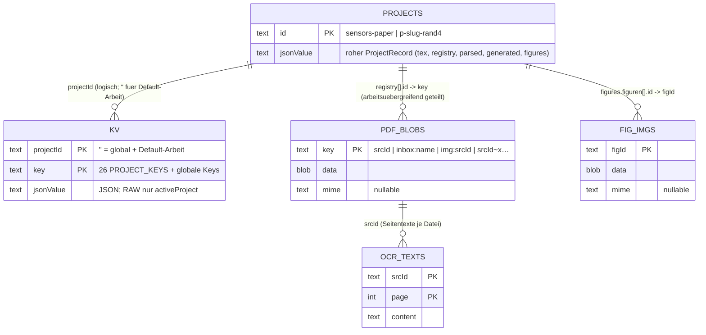
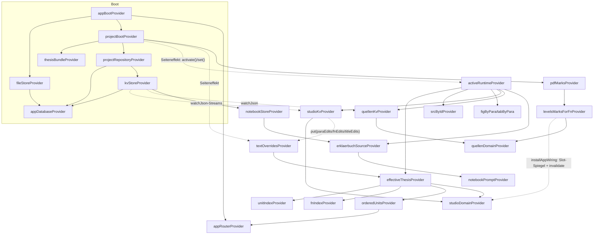

# getmedoc.md — Die Flutter-Konvertierung von „Thesis Studio“ erklärt

Stand: 2026-07-23 · Zielgruppe: technisch versierte Leser, die das Original (Vanilla-JS-SPA unter
`/js` + `/css`) kennen. Grundlage dieses Dokuments ist der **reale Code unter `lib/`** — alle
Signaturen, Feld- und Providernamen sind daraus zitiert — plus `docs/CONTRACTS.md` (§0–§15),
`docs/BAUPLAN.md` (E1–E12) und die Bestandsaufnahme `docs/inventory/` (Dossiers 00–10).

---

## Inhaltsverzeichnis

1. [Überblick & Zielbild](#1-überblick--zielbild)
2. [Architektur](#2-architektur)
3. [Alle Designentscheidungen](#3-alle-designentscheidungen)
4. [Datenbankschema](#4-datenbankschema)
5. [Mappings Original → Flutter](#5-mappings-original--flutter)
6. [Riverpod-/State-Konzept](#6-riverpod-state-konzept)
7. [Konkrete Schnittstellen](#7-konkrete-schnittstellen)
8. [PDF-Engine-Innenleben](#8-pdf-engine-innenleben)
9. [Test-Strategie](#9-test-strategie)
10. [Bekannte Grenzen & Ausbaupfade](#10-bekannte-grenzen--ausbaupfade)

---

## 1. Überblick & Zielbild

**Was die App ist.** „Thesis Studio“ ist ein Werkzeug für Quellen- und Belegarbeit an
wissenschaftlichen Arbeiten. Ground Truth ist immer der LaTeX-Quelltext einer Arbeit; darüber
liegen (a) die deterministisch geparste Struktur (Kapitel → Abschnitte → Absätze → Fußnoten →
Quellen), (b) eine GPT-Voranalyse (Kernaussagen, Satz-Zerlegungen, Beleg-Vermutungen, Dossiers,
Connections, Erklärbuch) und (c) der lokale „Prüfstand“ des Nutzers (Beleg-Status, PDF-Markierungen,
Zitate, Notizen, Edits). Die zentrale Tätigkeit: Fußnote für Fußnote vom KI-vermuteten Beleg
(Stufe 1 ✦) über die gefundene Originalpassage (Stufe 2 ❝) zur gesicherten Position im PDF
(Stufe 3 ✓) eskalieren. Mitgeliefert: die EHDS-Bachelorarbeit (dt., 6 Kapitel, 69 Units,
233 Absätze, 397 Fußnoten, 74 Quellen) als Default-Arbeit plus das Sensors-Paper (engl.) als
zweite eingebaute Arbeit; eigene Arbeiten entstehen aus `.tex`.

**Was die Konvertierung leistet.** Das Original ist eine serverlose Browser-SPA aus 23 klassischen
`<script>`-Globals (kein Modulsystem, kein Build), Zustand in localStorage + 3 IndexedDB-Datenbanken.
Die Flutter-App portiert **das komplette Produkt** — alle 6 Bereiche (Studio, Quellen, Wissen,
Projekt, Hilfe, Dokument), die PDF-Engine mit Markier-Workflow, die 7-Flow-KI-Schicht inkl.
Claude-SSE-Client und Demo-Modus, das Erklärbuch mit eigener Chart-Engine — bei **bit-kompatiblen
Austauschformaten** (`ehds-belegstand` v2, `thesis-studio-projekt` v1, Datei-Auftrag-ZIP,
Resolution 1.0, CRC32-`srcHash`): Daten aus der Web-App lassen sich verlustfrei mitnehmen und
zurückspielen. Der gesamte Fachzustand liegt in **einer** Drift/SQLite-Datenbank (E7); das
`location.reload()`-Architekturmuster des Originals wurde durch einen expliziten
Provider-Reboot ersetzt (E8).

**Plattformen.** Ein Codebase für Web (Drift über `sqlite3.wasm`/OPFS, pdfrx über `pdfium.wasm`,
Hash-URLs `#/…` bleiben gültig), Desktop (Linux/macOS/Windows, SQLite-Datei + pdfium-Binary) und
Mobil (Android/iOS-Runner sind angelegt; Mobile-UX ist wie im Original „gestapelt“, siehe §10).
Verifikationsstand Welle 2 (Gate 2): `flutter analyze` 0 Issues, `flutter test` 371 Tests grün,
`flutter build web --release` erfolgreich.

---

## 2. Architektur

### 2.1 Die vier Schichten

```
lib/
  main.dart          Boot-Sequenz (appBootProvider) + ThesisStudioApp (Splash → Router)
  app_wiring.dart    Verdrahtungs-Sweep: wireAppSlots() + installAppWiring(ref)
  core/              theme/ · router/ · shell/ · widgets/ · richtext/ · util/
  data/              models/ · bundles/ · db/ · export/ · repos/
  domain/            reine Dart-Ports (UI-frei): levels, connections, mentions,
                     stylecheck, texparse, editor_logic (+ domain_context/domain_store)
  features/          studio/ · quellen/ · pdf/ · wissen/ · projekt/ · hilfe/ · doc/ · ai/
```

* **`core/`** — alles, was jede Ansicht braucht: das Designsystem als `ThemeExtension`
  (`BookClothTokens`), der `GoRouter`-Baum, die App-Shell (Topbar + ein scrollender Main + Footer),
  wiederverwendbare Widgets (Modal mit Ein-Modal-Semantik, `ResizerHandle`, `VizTip`, Chips,
  Magic-Buttons …), der RichText-Builder (Ersatz der U+0001-Sentinel-Pipeline des Originals)
  und UI-freie Utilities (CRC32/`srcHash`, Satz-Zerlegung, de-AT-Formatierung).
* **`data/`** — Modelle (handgeschrieben, unveränderlich, **tolerante `fromJson`-Fabriken**),
  Bundle-Loader für die sechs Daten-Assets, die Drift-Datenbank samt `KvStore`, die vier
  bit-kompatiblen Export-Formate, die Repositories (`ProjectRepository`, `FileStore`, `FigStore`).
* **`domain/`** — die Fachlogik als reine Dart-Ports mit Golden-Tests gegen die JS-Originale.
  Zwei Abstraktionen entkoppeln sie von UI und Persistenz: `DomainContext` (unveränderliche
  Datensicht mit `unitIndex`/`fnIndex`/`srcById`/…) und `DomainStore` (`{Object? read(key);
  void write(key, value)}` mit logischen Keys).
* **`features/`** — Feature-First-Schnitt entlang der Original-Views; jedes Paket hatte während
  des Baus exklusive Verzeichnis-Eignerschaft (Wellenplan im BAUPLAN), Querbezüge laufen über
  vertragliche Slots in `app_wiring.dart` (§7).

### 2.2 Modulkarte Original-JS → Flutter

| Original (js/, css/) | Flutter-Ort | Bemerkung |
|---|---|---|
| `theme.css`, `app.css` | `core/theme/` (tokens, typography, theme, color_mix) | alle Custom-Properties als `BookClothTokens` (§5.4) |
| `gate.js` | — entfällt | E6, Passwort-Gate ohne Funktion in einer App |
| `app.js` (Bootstrap/Router) | `main.dart`, `core/router/`, `core/shell/` | Boot = `appBootProvider`; Hash-Router = `GoRouter` (§5.5) |
| `util.js` (U, Indizes, Storage, richText, Modal, gptModal) | `core/util/`, `core/richtext/`, `core/widgets/`, `data/bundles/indexes.dart`, `data/db/kv.dart` | das Monolith-Fundament wurde entlang der Schichten zerlegt |
| `data/data_*.js` (5 Bundles + project_sensors) | `assets/data/bundles/*.json` + `data/bundles/bundle_loader.dart` | 1-Zeilen-JS zu reinem JSON gestrippt, inhaltlich identisch |
| `projects.js` | `data/models/project.dart`, `data/repos/project_repository.dart`, `data/export/projekt_format.dart`, `data/db/seed.dart` | Modell/Repo/Format/Seeding getrennt |
| `levels.js` | `domain/levels.dart` + `data/export/belegstand.dart` | Kaskade UI-frei; Export als eigenes Format-Modul |
| `connections.js` / `mentions.js` / `stylecheck.js` | `domain/connections.dart` / `mentions.dart` / `stylecheck.dart` | reine Ports, Golden-getestet |
| `texparse.js` | `domain/texparse.dart` | 14-stufige Pipeline, dt. Fehlertexte wörtlich |
| `editor.js` (Logik) | `domain/editor_logic.dart` | reconstruct/inlineToTex/lint/preview/fullDocument |
| `editor.js` (UI) | `features/studio/editor/` | Split, Lint-Ansicht, Live-Preview, Snippets |
| `ziputil.js` | `data/export/dateiauftrag.dart` (`createStoreZip`/`readZip`) | package:archive, STORE erzwungen |
| `pdfstore.js` | `data/repos/file_store.dart` | IndexedDB-Blobs → Drift `PdfBlobs`, Schlüsselschema 1:1 |
| `figures.js` | `data/repos/fig_store.dart` + `features/pdf/figures/figure_card.dart` | |
| `pdfengine.js` | `features/pdf/` (viewer/, marks/, search/, assign_panel/) | pdfrx statt pdf.js-Vendor (§8) |
| `views_studio.js` | `features/studio/` (layout/, lesen/, pruefen/, refmode/, views/) + `features/doc/` | |
| `views_quellen.js` | `features/quellen/` (library/, detail/, import/, store_modal/, state/) | |
| `notebook.js`, `charts.js`, `views_analyse.js` | `features/wissen/` (notebook/, charts/, math/, tabs/, analysemodus/) | Charts als CustomPainter (E11) |
| `views_projekt.js`, `views_hilfe.js` | `features/projekt/`, `features/hilfe/` | |
| `enhance.js`, `claude.js` | `features/ai/` (flows/, hub/, panel/, dock/, client/, paste_modal/) | |

### 2.3 Begründungen des Schnitts

1. **Ladereihenfolge → Schichtung.** Die harte `<script>`-Reihenfolge des Originals (util → claude →
   enhance → … → app.js) ist die Abhängigkeitsrichtung; sie wurde in die Schichten core → data →
   domain → features übersetzt. Laufzeit-Zyklen des Originals (Studio ↔ Enhance, pdfengine →
   linkEditModal) sind als **statische Slots/Hooks** aufgelöst (`StudioSlots`, `AssignPanelHooks`,
   `QuellenGptHooks`, `QuellenRefModeHook`, `InstanzGenerateHook`), die `app_wiring.dart` beim Boot
   füllt — kein Feature importiert ein Schwester-Feature direkt gegen die Schichtrichtung.
2. **Unveränderliche Daten statt Global-Mutation.** Das Original überschreibt beim Projektwechsel
   alle `window.DATA_*`-Globals in-place und flickt Overrides mit `_orig`-Sicherungskopien in die
   Daten. Hier bleiben die Quelldaten unveränderlich; Overrides leben im `textOverridesProvider`,
   und `effectiveThesisProvider` berechnet die effektive Sicht (`data/bundles/indexes.dart`).
   „↺ Original wiederherstellen“ ist schlicht das Entfernen des Overrides.
3. **Rohes JSON als Persistenz-Wahrheit.** `ProjectRecord` und `PdfMark` halten das **rohe JSON**
   und bieten typisierte Getter — unbekannte Fremd-Felder überleben jede Lese-Schreib-Runde
   bitgenau (E7-Kompatibilitätsgarantie).

---

## 3. Alle Designentscheidungen

### 3.1 Die fixierten Produktentscheidungen E1–E12 (BAUPLAN)

| # | Entscheidung | Warum | Umsetzung im Code |
|---|---|---|---|
| E1 | **Serif = PT Serif** (gebündelt, 400/400i/700) | Original nutzt System-Serif (Iowan/Palatino/Georgia) ohne Datei; PT Serif ist plattformstabil | `AppFonts.serif` (`core/theme/typography.dart`), auch im Doc-Print (`DocPrintFonts`) |
| E2 | **Noto Sans Symbols 2** als Fallback-Font | ⭳⭱⌖⌗⇤⇥∅⤳◐ etc. rendern sonst nicht überall | `AppFonts.symbols` in allen Fallback-Ketten |
| E3 | **OCR entfällt in V1** | kein tragfähiges Cross-Plattform-Plugin (Tesseract.js kam vom CDN) | UI-Platz mit Hinweis (`features/pdf/viewer/ocr_bar.dart`); Drift-Tabelle `OcrTexts` + `ocrDao` existieren bereits für Datenmitnahme/Ausbau |
| E4 | **js-/py-Zellen im Erklärbuch: rendern, nicht ausführen** | Pyodide/`new Function` nicht portierbar; alle anderen Blocktypen (chart/table/math/latex/figure/include) laufen nativ | `features/wissen/notebook/nb_cell.dart` stellt Code-Zellen dar, führt sie nicht aus |
| E5 | **pdfToTex (Beta) zurückgestellt** | war Beta im Original; braucht per-Fragment-Fontgrößen; `.tex`-Import ist der Hauptpfad | „Neue Arbeit“ nimmt nur `.tex` (`showNeueArbeitModal`, Live-Parse 450 ms) |
| E6 | **Passwort-Gate entfällt** | Türsteher fürs statische Hosting, in einer App ohne Funktion | `gate.js` hat kein Pendant; der RAW-Key `gateOk` existiert nicht mehr (`kv.dart`) |
| E7 | **Gesamter Fachzustand → Drift/SQLite**, Export-Formate bit-kompatibel | Datenmitnahme aus der Web-App garantiert | §4 + §5; Roundtrip-Tests in `test/data/` |
| E8 | **`location.reload()` → expliziter Provider-Reboot** | architektonisch klarer; Stale-Cache-Bugs (L2) dabei gefixt | `ProjectBoot.reboot()/activateProject(id)` (`project_repository.dart:448-478`) |
| E9 | Original-Bugs W8 + W9 **gefixt**, nicht nachgebaut | Kategorie „100 % sicher besser“, vom Nutzer freigegeben | siehe §3.3 |
| E10 | API-Key in der lokalen DB, klar dokumentiert | Parität zum Original (Klartext-localStorage) | globaler KV-Key `claudeCfg` (`ClaudeCfgStore`); secure-storage als dokumentierte Ausbaustufe |
| E11 | Charts als **CustomPainter** | Pixel-Nähe (nice-Ticks, de-AT-Format, Vollkreis-Sonderfall) vor Bibliothekskomfort | `features/wissen/charts/` — 7 Typen + `BarHChart`, `Timeline`, `FazitGraphChart`, `KapitelFluss` |
| E12 | Kommentare Deutsch, Bezeichner Dart-konventionell | Stil-Parität mit dem erklärenden Original | durchgängig; jede Datei nennt die Original-Fundstelle (`datei.js:zeile`) |

### 3.2 Während des Baus getroffene Entscheidungen (CONTRACTS §13–§15)

| Entscheidung | Warum | Fundort |
|---|---|---|
| **KV-Scope-Spalte statt Key-Präfix**: `projectId ''` = unpräfixiert (globale Keys UND Prüfstand der Default-Arbeit), sonst Projekt-id | bildet `'ehds.' + (scoped ? '<proj>.' : '') + key` semantisch exakt ab, ohne String-Parsing | `data/db/kv.dart` |
| **RAW-Keys behalten den Typ-Mix**: `activeProject` als nackter String (`KvKeys.rawKeys`), `pdfZoomPref` bleibt `"fit"`-oder-Zahl | Migrations-Bitkompatibilität; keine „Aufräum“-Migration | `kv.dart`, `pdf_engine_view.dart` |
| **Boot-Reihenfolge hart**: FileStore.ready (Fehler geschluckt) → Scope setzen → Seeding → Belegstand-Import-Once → Runtime → Overrides | exakt app.js:6-50; Scope VOR Runtime, sonst kontaminiert ein Fehler den Prüfstand der Default-Arbeit (projects.js:40-42) | `main.dart:47-60`, `project_repository.dart:346-403` |
| **`\s`-Slots statt Provider für Paket-Verdrahtung** (`StudioSlots` als statisches Registry-Objekt) | die Hooks sind Verdrahtung zwischen Paketen, kein reaktiver Zustand | `studio_slots.dart:40-42` |
| **Generation-Token gegen Async-Races**: `StudioFileState.gen`; `show()` zählt hoch (Re-Mount), `setFn()` nicht | Port des `gen !== Studio.file.gen`-Schutzes: verspätete Lader alter Generationen verschwinden mit ihrem Widget | `studio_state.dart:571-595`, `app_wiring.dart:61-67` |
| **Checker/Referenzen strukturiert statt HTML**: `AiCheckResult`/`AiReference`/`RichBit` | das HTML des Originals war Projektion; der WORTLAUT der Meldungen bleibt exakt | `features/ai/flows/ai_flow.dart` |
| **Snapshot + Write-Through + Drift-Streams** für synchrone Lesbarkeit (`StudioKv`, `QuellenKv`) | das Original las localStorage synchron in jeder Render-Runde; die Streams ersetzen den „gemeinsamen localStorage“ zwischen den Welten (Gate-2-Fix: Deep-Equality-Guard gegen Echo-Rebuilds) | `studio_state.dart:286-388`, `quellen_kv.dart` |
| **Endnoten je Kapitel statt Seitenfußnoten** im PDF-Druck | package:pdf hat kein Seitenfußnoten-Layout; dokumentierte Abweichung im Datei-Kopf | `features/doc/doc_print.dart` |
| **`fmtDeNum` gruppiert mit U+00A0** (echtes de-AT-CLDR) | die JS-`toLocaleString` nutzte je nach Engine schmale Leerzeichen; CLDR ist die kanonische Wahl | `core/util/format.dart` |
| **Belegstand hat 22 Bereiche** (Dossier-Zählfehler „21“) | levels.js:197-218 ist der Vertrag, nicht das Dossier | `data/export/belegstand.dart:41-65` |
| **ZIP-Zeitstempel nicht 1980-exakt** | package:archive erlaubt die festen Original-Stempel nicht; für die Hash-Zuordnung irrelevant | `dateiauftrag.dart:139-150` |
| **Fokus-Glow als 2-px-Border**, kein `theme-color`-Meta im Web | Flutter-Renderer-Grenzen, sichtbar gleichwertig | CONTRACTS §13.3 |
| **Ein-Modal-Semantik** (`showAppModal` schließt das alte Modal inkl. Cleanup-Hook) | `_modalCleanup`-Pendant | `core/widgets/modal.dart` |
| **W10: Resolution-Obergrenze dynamisch** — `checkResolution(..., footnoteCount:)` statt hartem `≤ 397` | das Original-Schema war auf die EHDS-Arbeit kodiert | `data/export/resolution.dart` |

### 3.3 Bewusst gefixte Original-Bugs

| Bug | Original-Verhalten | Fix in Flutter | Fundort |
|---|---|---|---|
| **W8 — EHDS-Prompt** | `gptPromptForSource` codiert „Bachelorarbeit über den EHDS“ hart — inhaltlich falsch für fremde Arbeiten | Prompt ist projektabhängig: `gptPromptForSource(Source s, {required String positionType, required EffectiveSrcLinks links, required String arbeitTitel})` — der Titel der aktiven Arbeit wird eingesetzt | `features/quellen/import/gpt_prompts.dart:68` |
| **W9 — `\cite`-Lint** | „＋ Quelle“ fügt `\cite{id}` ein, aber `\cite` fehlt in `ALLOWED` → der Lint meldet sofort einen Fehler | `cite` steht in der Erlaubt-Liste des Editor-Lints | `domain/editor_logic.dart:110` |
| **L2 — Stale Caches** | `U._hashCache`, `U.pdfStatusCache` werden bei `rebuildDataIndexes` nicht geleert; `FigStore._urls` revoked nie | `ProjectBoot.reboot()` ruft `FileStore.resetStatusCache()`; `srcShortProvider`/`DomainContext` invalidieren mit dem Runtime-Wechsel automatisch; der ObjectURL-Cache entfällt strukturell | `project_repository.dart:464-470`, `indexes.dart:380-385`, `fig_store.dart:5` |
| **L7 — Überblick-Breakpoint** | ≤ 900 px wird nur einmalig beim Render ausgewertet (kein Live-Resize) | `LayoutBuilder` macht den Breakpoint automatisch live | `features/wissen/tabs/ueberblick_tab.dart:6` |

Alle vier sind Kommentar-markiert im Code (`grep -rn "W8\|W9\|L2\|L7" lib`).

### 3.4 Bewusst NICHT übernommen

| Feature | Warum weggelassen | Erweiterungspfad |
|---|---|---|
| **OCR** (Tesseract.js 5.1.1, CDN, `deu+eng`) | E3: kein tragfähiges Web+Desktop+Mobil-Plugin; CDN-Abhängigkeit widerspricht der Offline-App | Tabelle `OcrTexts` (`{srcId, page, content}`) + `ocrDao` sind fertig; mobil `google_mlkit_text_recognition`, Desktop Tesseract-FFI andocken; Cache-Format und Präfix `[S. n — OCR]` sind dokumentiert |
| **Pyodide-/js-Zellen-Ausführung** | E4: `new Function` + Pyodide-CDN nicht portierbar | Zellen werden als Code-Blöcke DARGESTELLT (`nb_cell.dart`); js-Zellen könnten über flutter_js/QuickJS mit nachgebauter Host-API (data/print/show/md/chart/table/figure/math) reaktiviert werden — der `NbBlock`-Parser kennt die Typen bereits |
| **Passwort-Gate** (`gate.js`, SHA-256-Check) | E6: Schutz fürs statische Hosting, in einer installierten App sinnlos | falls je nötig: Plattform-Login/App-Lock statt Hash-Gate; der Key `gateOk` ist bewusst NICHT in `KvKeys` |
| **pdfToTex (Beta)** | E5: braucht per-Item-Fontgrößen aus dem PDF-Textlayer; im Original explizit Beta | pdfrx liefert Zeichenboxen (`PdfPageText.charRects`) — die Schriftgrößen-Heuristik ließe sich in `domain/` als neuer Port ergänzen; TexParse als Abnehmer steht |
| **File-System-Access-Legacy-Ordner** (`handles`-Store `'dir'`) | war im Original bereits Altbestand | entfällt ersatzlos (Master §2 „Empfehlung: weglassen“) |
| **`Notebook.get(projectAware)`-Parameter** | L6: toter Code im Original (Parameter wird ignoriert) | nicht nachgebaut |

---

## 4. Datenbankschema

Eine Drift-Datenbank `thesis_studio` (`data/db/database.dart`, `schemaVersion 1`) ersetzt
localStorage + 3 IndexedDB-Datenbanken. Web: WASM/OPFS über `web/sqlite3.wasm` +
`web/drift_worker.js` (im Repo, Herkunft in `web/DRIFT-WEB-ARTEFAKTE.md`); nativ: SQLite-Datei
im App-Support-Verzeichnis; Tests: `AppDatabase(NativeDatabase.memory())`.

### 4.1 Tabellen

**`Projects`** (`@DataClassName('ProjectRow')`) — Pendant zu IndexedDB `ehds-projects.projects`:

| Spalte | Typ | Key | Inhalt |
|---|---|---|---|
| `id` | TEXT | PK | Projekt-id (`sensors-paper`, `p-<slug30>-<rand4>`, …). Die virtuelle Default-Arbeit `'default'` steht **nie** in der Tabelle |
| `jsonValue` | TEXT | | der komplette ProjectRecord als rohes JSON (inkl. `tex`, `registry`, `parsed`, `generated`, `figures`) — nicht normalisiert, Export/Import erwartet 1:1 dieselbe Struktur |

**`Kv`** (`KvRow`) — Pendant zum localStorage-Schema:

| Spalte | Typ | Key | Inhalt |
|---|---|---|---|
| `projectId` | TEXT | PK₁ | `''` = unpräfixiert (globale Keys + Prüfstand der Default-Arbeit); sonst Projekt-id |
| `key` | TEXT | PK₂ | logischer Key (`belegLevels`, `theme`, …) |
| `jsonValue` | TEXT | | JSON-serialisierter Wert; RAW-Keys (`activeProject`) speichern den nackten String |

**`PdfBlobs`** (`PdfBlobRow`) — Pendant zu IndexedDB `ehds-pdfstore.blobs`, arbeitsübergreifend:

| Spalte | Typ | Key | Inhalt |
|---|---|---|---|
| `key` | TEXT | PK | Schlüsselschema 1:1 (pdfstore.js:44-51): `<srcId>` Haupt-PDF · `inbox:<Dateiname>` Ablage · `img:<srcId>` Bild-Quelle · `<srcId>~x<ts36><rand>` weiteres Material |
| `data` | BLOB | | Dateiinhalt |
| `mime` | TEXT? | | MIME-Typ (für Bilder relevant) |

**`FigImgs`** (`FigImgRow`) — Pendant zu IndexedDB `ehds-figstore.imgs`, arbeitsübergreifend:

| Spalte | Typ | Key | Inhalt |
|---|---|---|---|
| `figId` | TEXT | PK | Abbildungs-id aus dem Figuren-Manifest |
| `data` | BLOB | | hochgeladenes Bild |
| `mime` | TEXT? | | MIME-Typ |

**`OcrTexts`** (`OcrRow`) — Pendant zum globalen Key `ehds.ocrText` (`{srcId: {page: text}}`),
als eigene Tabelle, weil einzelne Seiten gelesen/geschrieben werden; bereitgestellt für den
OCR-Ausbau (E3):

| Spalte | Typ | Key | Inhalt |
|---|---|---|---|
| `srcId` | TEXT | PK₁ | Quellen-id |
| `page` | INT | PK₂ | 1-basierte Seite |
| `content` | TEXT | | erkannter Seitentext |

DAOs (`db.<name>Dao`): `projectsDao` (`getAll/getById/upsert/deleteById` mit `ProjectRecord`),
`kvDao` (`read/write/remove/watch(projectId, key)` — `watch` speist die Live-Kohärenz, §6),
`fileBlobsDao`, `figImgsDao`, `ocrDao` (`read/write/allForSource`).

### 4.2 ER-Diagramm

Die Beziehungen sind **logisch** (JSON-Schlüssel), nicht als Fremdschlüssel erzwungen — genau wie
im Original (IndexedDB kennt keine FKs; die Formate sind der Vertrag):



Der KV-Wert `pdfMarks` (im Prüfstand) referenziert wiederum `PdfBlobs.key` über die `srcId` —
die Zwei-Ebenen-Trennung des Originals (Prüfstand projekt-gescoped, Dateien arbeitsübergreifend)
bleibt exakt erhalten.

### 4.3 Das KV-Modell: 26 PROJECT_KEYS + globale Keys

Scope-Regel (`KvStore.scopeFor`, `kv.dart:115-116`): gescoped wird **nur**, wenn eine
Instanz-Arbeit aktiv ist (`storeProject != ''`) UND der Key auf der Whitelist steht.
Die Whitelist hat exakt **26 Einträge** (W1 — verifiziert an util.js:200-201; Dossier 07 hatte
sich mit „25“ verzählt).

**Projekt-gescopte Keys (`KvKeys.projectKeys`, Original-Reihenfolge):**

| # | Key | Datenform (JSON) | Schreiber |
|---|---|---|---|
| 1 | `belegLevels` | `{"<fn>": {zitat?, seite?, fundstelle?, kommentar?, farbe?, herkunft?, level, ts}}` — `level` wird bei `save()` berechnet (seite/fundstelle→3, zitat→2), leerer Rest löscht den Eintrag | `Levels.save` |
| 2 | `annotations` | `{"<srcId>": [{footnote, seite?, fundstelle?, zitat?, status?, …}]}` — manuelle Fundstellen (herkunft `'manuell'` in der Kaskade) | Quellen-Detail |
| 3 | `resolutions` | `{"<srcId>": {formatVersion:"1.0", sourceId, generatedBy?, stellen:[{footnote, seite?, zitat?, kommentar?, status?}]}}` | KI-Durchlauf (`quellen`-Flow) |
| 4 | `pdfManual` | `{"<srcId>": true}` — „hat PDF“-Handmarkierung | AssignPanel |
| 5 | `linkOverrides` | `{"<srcId>": {official?, file?}}` | ✎-Link-Modal |
| 6 | `srcNotes` | `{"<srcId>": "Notiz"}` — **Export-Feld heißt `notes`** (W7!) | Quellen-Detail |
| 7 | `srcTexts` | `{"<srcId>": "Volltext"}` | Quellen-Detail/RefMode |
| 8 | `texEdits` | `{"<sectionId>": "LaTeX-Quelltext"}` | ✎-Editor |
| 9 | `pdfMarks` | `{"<srcId>": [{id:"m<ts36><rand3>", ts, fn?, page, farbe?, zitat, rects:[{x,y,w,h}], comment:{x,y,text}?}]}` — Rects 0..1, Ursprung oben links | `PdfMarks`-Store |
| 10 | `customSources` | `[{id, kind, title, author?, year?, …}]` (Array!) | ＋ Quelle / 🤖 Ergänzung |
| 11 | `kiConnections` | `{connections: [{id, typ, von:{sectionId,paraId}, nach:{…}, label, text}]}` | `conn`-Flow-Import |
| 12 | `textMentions` | `{"<paraId>\|<fingerprint>": {status: offen\|bestaetigt\|verworfen\|beleg, srcId, fn?}}` (mit Alt-Format-Migration in `Mentions.statusEntry`) | Erwähnungs-Workflow |
| 13 | `fileSearch` | `{"<srcId>": {venue?, …Recherche-Notizen}}` | Datei-Recherche |
| 14 | `dlStatus` | `{"<srcId>": "ok"\|"fail"\|…}` | Download-Engine |
| 15 | `paraDock` | `{"<viewId>": {"<paraId>": "Markdown"}}` | Instanz-Fenster / `inst`-Flow |
| 16 | `paraEdits` | `{"<paraId>": "Text"}` — wirkt nur auf `type == text`-Absätze | Absatz-Doppelklick-Edit |
| 17 | `dockBySection` | `{"<sectionId>": viewId\|null}` — **`null` heißt „geschlossen“** (Override-Semantik!) | View-Auswahl je Abschnitt |
| 18 | `marksExtra` | `{"<paraId>": [{snippet, kategorie}]}` | `marks`-Flow-Import |
| 19 | `notebook` | `"…Markdown…"` (String; leer ⇒ gelöscht) | Notebook-Editor / `buch`-Flow |
| 20 | `studioLast` | `"3.2.2"` (String) — von der Import-Once-Prüfung ausgenommen | Studio-Navigation |
| 21 | `assignDismissed` | `{"<srcId>": ["dateiname.pdf", …]}` — „✗ passt nicht“ | AssignPanel |
| 22 | `fnEdits` | `{"<fnNum>": "Text"}` | Fußnoten-Edit |
| 23 | `belegSpans` | `{"<fnNum>": <int zurück-Sätze>}` | Spannen-Steuerung ± Satz |
| 24 | `titleEdits` | `{"ch<num>"\|"<sectionId>": "Titel"}` | ✎-Umbenennen im Kapitelbaum |
| 25 | `srcDoc` | `{"<srcId>": {typ: "web"\|"img", url?, …}}` (SrcDocDef) | „Quelle definieren als …“ |
| 26 | `srcExtras` | `{"<srcId>": [{key, label?, …}]}` — Material-Liste (`~x`-Blobs) | Material-Tab |

**Globale Keys (nie gescoped):**

| Key | Datenform | Anmerkung |
|---|---|---|
| `activeProject` | RAW-String (`"sensors-paper"`) | einziger RAW-Key (`KvKeys.rawKeys`); `gateOk` existiert nicht mehr (E6) |
| `builtinDeleted` | `["sensors-paper", …]` | Tombstones gelöschter Builtins |
| `belegstandImported` | `true` | Einmal-Import-Flag (app.js:25) |
| `theme` | `"light"`\|`"dark"`\|nicht gesetzt (= auto) | `ThemeController` |
| `claudeCfg` | `{key, model, …}` — **API-Key im Klartext** (E10) | `ClaudeCfgStore` |
| `enhCfg` | `{"<flowId>": {instruction, …}}` | per-Flow-Zusatzinstruktion |
| `instDefs` | `[{id, label, color, desc, srcTex?}]` | eigene Views (arbeitsübergreifend) |
| `pdfZoomPref` | `"fit"` ODER Zahl (Typ-Mix wie im Original!) | Viewer-Zoom |
| `qColl` / `qSort` / `uiLibPct` | `"alle"`… / `"zit"`… / Zahl | Bibliothek-Filter/Sortierung/Breite |
| `cats`, `studioMode`, `lesenDichte`, `lesenFast`, `lesenMarks`, `uiDockMode`, `uiSfDockClosed`, `uiStyleCheck`, `uiFileOff`, `uiTreeOff`, `uiFileW`, `uiTreeW`, `uiPsW`, `uiSfDockH` | Studio-UI-Zustand (`StudioUiKeys`, `studio_state.dart:45-61`) | Resizer-Werte px |
| `uiRefW` | Zahl (px, min 240) | RefMode-Spaltenbreite (`kUiRefWKey`) |
| `uiEdPct` | Zahl (25–70, Default 50) | Editor-Split (`kUiEdPctKey`) |
| `wissenLens` | `"erklaerung"`… | Analysemodus-Linse (`wissenLensKey`) |

Wichtige `KvStore`-Semantik (Port von `storeGet`/`storeSet`): fehlender/leerer Eintrag oder
Parse-Fehler → Fallback; `hasAnyProjectState()` prüft alle PROJECT_KEYS außer `studioLast` mit
JS-Truthy-Semantik (Import-Once-Guard); `watchJson(key)` liefert den dekodieren Drift-Stream.

### 4.4 Testdaten — echte Beispielzeilen je Tabelle

Werte aus `assets/data/bundles/*.json` (Seed-Material) bzw. den Golden-Fixtures
(`test/domain/fixtures/`, mit Node aus den JS-Originalen erzeugt, fixierte Uhr
`FIXED_NOW = 1753222000000`).

**`Projects`** (Zeile 1 wird beim Erst-Boot aus `builtin_projects.json` geseedet; Zeile 2 zeigt
das Format einer aus `.tex` erzeugten Arbeit, id-Schema `newProjectId`):

| id | jsonValue (gekürzt, echte Feldwerte) |
|---|---|
| `sensors-paper` | `{"id":"sensors-paper","name":"Mobile Sensors in Education (Paper)","created":"2026-07-18T00:00:00.000Z","builtin":true,"builtinVersion":6,"tex":"% This is samplepaper.tex, …","registry":[{"id":"abowd_towards_1999","kind":"konferenz","author":"Abowd, G. D.; Dey, A. K.; …","year":1999,"title":"Towards a Better Understanding of Context and Context-Awareness","doi":"10.1007/3-540-48157-5_29","aliases":["abowd_towards_1999"]}, … 24 Quellen], "parsed":{"thesis":{"meta":{"title":"Mobile Sensors as a Source for Context-Aware Tech…"}, …}}, "generated":{"sections":{"0_0":{"sectionId":"0.0","paragraphs":[…]}, …}}, "figures":{"figuren":[],"tabellen":[]}}` |
| `p-meine-arbeit-a1b2` *(Beispiel-Schema)* | `{"id":"p-meine-arbeit-a1b2","name":"Meine Arbeit","created":"<isoNowUtc()>","builtin":false,"userModified":true,"tex":"\\documentclass…","registry":[…],"parsed":{…}}` |

**`Kv`** (Zeile 1 RAW; Zeilen 2–3 mit echten Werten aus `fixtures/levels.json` bzw. dem
`pdfMarks`-Vertragsformat aus `pdf_mark.dart`):

| projectId | key | jsonValue |
|---|---|---|
| `''` | `activeProject` | `sensors-paper` *(RAW, kein JSON)* |
| `''` | `belegLevels` | `{"17":{"zitat":"Der Wortlaut der Passage.","seite":14,"kommentar":"leicht gekürzt","farbe":"blau","herkunft":"manuell","level":3,"ts":1753222000000},"23":{"farbe":"gelb","level":0,"ts":1753222000000},"40":{"fundstelle":"Art 5 Abs 1","level":3,"ts":1753222000000}}` |
| `''` | `pdfMarks` *(Formatbeispiel nach `pdf_mark.dart`; fn 95 ist die echte erste Zitierstelle von `aljarullah2013`)* | `{"aljarullah2013":[{"id":"m1v0z3ka9x2f","ts":1753222000000,"fn":95,"page":3,"farbe":"blau","zitat":"A semi-centralized approach …","rects":[{"x":0.118,"y":0.402,"w":0.63,"h":0.017}],"comment":{"x":0.94,"y":0.402,"text":""}}]}` |
| `sensors-paper` | `studioLast` | `"2.1"` *(echte Section-id des Sensors-Papers: `0.0, 1.1, …, 2.1, …`)* |
| `''` | `theme` | `"dark"` |

**`PdfBlobs`** (Schlüssel nach dem Original-Schema; `ts-b5b9aca8` ist der **echte** srcHash
von `aljarullah2013`, verifiziert in `test/data/crc32_test.dart:27-34`):

| key | data | mime |
|---|---|---|
| `aljarullah2013` | *(PDF-Bytes, `%PDF-…`)* | `application/pdf` |
| `inbox:ts-b5b9aca8.pdf` | *(PDF aus dem Datei-Auftrag-Rücklauf, noch unzugewiesen)* | `application/pdf` |
| `img:ehds-vo` | *(PNG/JPEG — Quelle als Bild definiert)* | `image/png` |

**`FigImgs`** (figId aus dem echten Manifest `assets/data/bundles/figures.json`):

| figId | data | mime |
|---|---|---|
| `abb-3-3-2` *(„Abb. 3.1 — Beispiel der Access Control Mechanism (ACM) Funktionen“, Anker `3.3.2-p4`)* | *(hochgeladenes Bild)* | `image/png` |
| `abb-4-1-1` | *(hochgeladenes Bild)* | `image/png` |

**`OcrTexts`** (Format-Vorhalt für den E3-Ausbau; Schema `ehds.ocrText` = `{srcId:{page:text}}`):

| srcId | page | content |
|---|---|---|
| `aljarullah2013` | 1 | `A Novel System Architecture for the National Integration of Electronic Health Records …` |
| `rh-elga2024` | 12 | `Der Rechnungshof empfahl …` |

---

## 5. Mappings Original → Flutter

### 5.1 localStorage → KV

| Original | Flutter | Regel |
|---|---|---|
| `ehds.<key>` (global oder Default-Arbeit) | `Kv(projectId: '', key)` | das `ehds.`-Präfix entfällt; `''` trägt wie im Original BEIDE unpräfixierten Namensräume |
| `ehds.<projektId>.<key>` (PROJECT_KEYS) | `Kv(projectId: '<id>', key)` | Scoping via `KvStore.scopeFor(key)` — nur die 26er-Whitelist |
| RAW-Strings (`activeProject`; früher `gateOk`) | `getRawGlobal/setRawGlobal` | `gateOk` entfällt (E6) |
| `ehds.ocrText` (global, `{srcId:{page:text}}`) | Tabelle `OcrTexts` | einzige Struktur-Hebung — seitenweiser Zugriff |
| Fehler „Speicher voll/privat“ still geschluckt | DB-Fehler propagieren | localStorage-Quota existiert nicht mehr; echte Fehler sollen sichtbar sein |

### 5.2 IndexedDB → Drift

| Original-DB | Store | Flutter-Tabelle | Anmerkung |
|---|---|---|---|
| `ehds-pdfstore` v1 | `blobs` (`<srcId>` / `inbox:` / `img:` / `~x`) | `PdfBlobs` | Schlüsselschema 1:1 (`FileKeys.inbox/img/extra/isInbox/isImg`) |
| `ehds-pdfstore` v1 | `handles` (`'dir'`, FS-Access-Legacy) | — entfällt | Altbestand schon im Original |
| `ehds-projects` v1 | `projects` (keyPath `id`) | `Projects` | `'default'` nie in der DB |
| `ehds-figstore` v1 | `imgs` (figId) | `FigImgs` | |

### 5.3 Export-Formate (Feld für Feld)

**`ehds-belegstand` v2** (`data/export/belegstand.dart`) — Umschlag
`{format:"ehds-belegstand", version:2, exportiert:<ISO-UTC>}`, JSON-Einrückung 1
(`JSON.stringify(…, null, 1)`-Pendant). Die 22 Bereiche in exakter Export-Reihenfolge;
Export-Default = `storeGet(key, default)`-Pendant:

| Export-Feld | Store-Key | Default | | Export-Feld | Store-Key | Default |
|---|---|---|---|---|---|---|
| `belegLevels` | `belegLevels` | `{}` | | `dlStatus` | `dlStatus` | `{}` |
| `annotations` | `annotations` | `{}` | | `paraDock` | `paraDock` | `{}` |
| `resolutions` | `resolutions` | `{}` | | `paraEdits` | `paraEdits` | `{}` |
| `pdfManual` | `pdfManual` | `{}` | | `dockBySection` | `dockBySection` | `{}` |
| `linkOverrides` | `linkOverrides` | `{}` | | `marksExtra` | `marksExtra` | `{}` |
| **`notes`** | **`srcNotes`** (W7!) | `{}` | | `notebook` | `notebook` | `null` |
| `srcTexts` | `srcTexts` | `{}` | | `texEdits` | `texEdits` | `{}` |
| `pdfMarks` | `pdfMarks` | `{}` | | `fnEdits` | `fnEdits` | `{}` |
| `kiConnections` | `kiConnections` | `null` | | `belegSpans` | `belegSpans` | `{}` |
| `customSources` | `customSources` | `[]` | | `titleEdits` | `titleEdits` | `{}` |
| `textMentions` | `textMentions` | `{}` | | `fileSearch` | `fileSearch` | `{}` |

Import-Semantik (`Belegstand.importState`): prüft **nur** `format` (nicht die Version); jeder
Bereich wird einzeln mit **JS-Truthy-Semantik** übernommen — `{}`/`[]` sind truthy und
überschreiben, `null`/fehlend lässt den Bestand stehen. Rückgabe = Anzahl der
`belegLevels`-Einträge.

**`thesis-studio-projekt` v1** (`data/export/projekt_format.dart`): Export =
`{format:"thesis-studio-projekt", version:1, …raw}` (der rohe Record, Einrückung 1). Import
(`parseProjectImport`) validiert `format` + `parsed.thesis` mit den deutschen Original-Fehlertexten;
fehlende id → `p-import-<rand6>`; Kollision → Dialog, bei „Nein“ Kopie `<id>-kopie-<rand3>` /
`<name> (Kopie)`. id-Schemata: `newProjectId(name)` = `p-<slug30>-<rand4>`.

**Datei-Auftrag-ZIP** (`thesis-studio-dateiauftrag` v1, `data/export/dateiauftrag.dart`) —
ZIP `datei-auftrag.zip` mit `auftrag.json` + `ANLEITUNG.txt` (9 Zeilen zeichengenau, bewusst
ohne Umlaute), Einträge STORE-unkomprimiert. Ein `auftrag.json`-Eintrag:

| Feld | Quelle |
|---|---|
| `hash` | `srcHashOf(id, title, longTitle, author, year)` = `'ts-' + CRC32hex8(norm(longTitle\|\|title)\|norm(author)\|jahr)` — bit-identisch (Polynom 0xedb88320, NFD-Diakritika-Strip; Beispiel: `aljarullah2013` → `ts-b5b9aca8`) |
| `dateiname` | `'<hash>.pdf'` — die Identität des Rücklaufs |
| `titel` | `longTitle \|\| title` |
| `autor` / `jahr` / `doi` | Quelle (leer → `null`) |
| `venue` | `fileSearch[id].venue \|\| container` |
| `linkOffiziell` / `linkDatei` | aufgelöste Links (`effectiveSrcLinks`: Override > `https://doi.org/<doi>` bzw. `url` > Vorschlag) |
| `openAccessBevorzugt` | immer `true` |

**Resolution 1.0** (`data/export/resolution.dart`): `{formatVersion:"1.0", sourceId,
stellen:[{footnote, seite?, zitat?, kommentar?, status?}]}`. `checkResolution(decoded,
{activeSourceId, required footnoteCount})` liefert `ResolutionCheck{ok, stellen, mitPos,
mitZitat, ohneNum, probleme}` — W10: Obergrenze dynamisch statt hartem `≤ 397`.
`normalizeResolutionForImport` erzwingt `sourceId` vor dem Schreiben nach `resolutions`.

### 5.4 CSS-Custom-Properties → `BookClothTokens` (Auszug)

Vollständige Liste: `lib/core/theme/tokens.dart` (alle Properties aus `css/theme.css` mit den
exakten Rohwerten Light `:root` / Dark `:root[data-theme="dark"]`). Zugriff:
`final t = BookClothTokens.of(context);` — color-mix-Ausdrücke über die Extension
`BookClothColorMix` (`t.accent.mix(t.bg, 20)` ≙ `color-mix(in srgb, var(--accent) 20%, var(--bg))`).

| CSS-Property | Token-Feld | Light | Dark |
|---|---|---|---|
| `--bg` | `t.bg` | `#f4f2ec` | `#1e1c17` |
| `--surface` / `-2` / `-3` | `t.surface/surface2/surface3` | `#fefdfb`/`#f9f7f1`/`#efece4` | `#27231d`/`#2e2a24`/`#39342c` |
| `--ink` / `--muted` | `t.ink` / `t.muted` | `#131316` / `#51535c` | `#f0ede5` / `#98917f` |
| `--accent` (Terracotta, EINZIGER Akzent) | `t.accent` | `#b4552d` | `#e28a5d` |
| `--good`/`--warn`/`--bad` | `t.good/warn/bad` (+`…Soft`) | `#3f7449`/`#96702c`/`#a04b3c` | `#8fb87f`/`#cfa05e`/`#d1806f` |
| `--lvl1`/`--lvl2`/`--lvl3` | `t.lvl1/lvl2/lvl3` (+ Helfer `t.lvl(int)/lvlSoft(int)`) | Beleg-Stufen | |
| `--cat-norm` … `--cat-schlag` (9×) | `t.catNorm…catSchlag` (+ `t.cat('norm')`) | Mark-Kategorien | |
| `--wissen`/`-ink`/`-soft`/`-line` | `t.wissen/wissenInk/wissenSoft/wissenLine` | Marineblau-Welt | |
| `--magic-top`/`-edge`/… | `t.magicTop/magicEdge/…` + `t.magicGrad` | Magic-CTA-Familie | |
| Schatten (3 Stufen) | `t.shadow1/shadow2/shadowPop` (`List<BoxShadow>`) | | |
| Hardcodes | `BookClothTokens.pdfPageBg` (#fff), `.searchHit` (`rgba(255,193,7,.6)`), `.searchHitOutline`, `.markFarben` (8er-Beleg-Palette gelb `#e8c33f` … rot, + `markFarbe(String?)`), `brandClaude/OpenAi`, … | statisch | |
| Maße | `radius=8, radiusSm=6, radiusXs=4, radiusLg=11, radiusPill=999, topbarH=56, bpStack=720, bpNarrow=900, bpWorkspace=999, bpWide=1200` | Konstanten | |

Typografie (`typography.dart`): `AppFonts` (ui=Inter, display=Space Grotesk, mono=JetBrains Mono,
serif=PT Serif (E1), magic=Baloo 2, symbols=Noto Sans Symbols 2 (E2) + Fallback-Ketten),
`AppFontSizes` (body 15.5, small 13.5, lesen 16.75, h1 27 …), `AppTextStyles`
(body/small/h1..h4/eyebrow/lesen/mono/form/button).

### 5.5 Hash-Routen → go_router (vollständige Routentabelle)

Web behält die **Hash-URL-Strategie** (Flutter-Web-Default) — gespeicherte `#/…`-Deep-Links aus
der Web-App bleiben gültig. EINE `ShellRoute` (`AppShell`) umschließt alle Live-Bereiche
(`core/router/router.dart`).

| Original-Hash | Flutter-Pfad | Screen (Konstruktor) |
|---|---|---|
| `#/studio` | `/studio` | `StudioScreen()` |
| `#/studio/<sec>` | `/studio/:sec` | `StudioScreen(sec:)` |
| `#/studio/<sec>/<modus>` | `/studio/:sec/:modus` | `StudioScreen(sec:, modus:)` — Modi `lesen`/`pruefen`/`editor` (W4: intern `pruefen`, Label „◉ Analyse“) |
| `#/studio/<sec>/<modus>/<para>` | `/studio/:sec/:modus/:para` | `StudioScreen(sec:, modus:, para:)` — Absatz-Anker als 4. Segment |
| `#/doc` | `/doc` | `DocScreen()` |
| `#/quellen` · `#/quellen/<id>` | `/quellen` · `/quellen/:id` | `QuellenScreen({id})` |
| `#/analyse` · `#/analyse/<tab>` · `#/analyse/<tab>/<arg>` | `/analyse[/:tab[/:arg]]` | `WissenScreen({tab, arg})` — 8 Tabs `buch, modus, instanzen, ueberblick, kapitel, fazit, kennzahlen, wuerdigung` (Default `ueberblick`) |
| `#/projekt` | `/projekt` | `ProjektScreen()` |
| `#/hilfe` · `#/hilfe/<topic>` | `/hilfe[/:topic]` | `HilfeScreen({topic})` |

**Redirects (Alt-Routen V1/V2 + Fallbacks, app.js:236-240):**

| Quelle | Ziel |
|---|---|
| `/` | `/studio` |
| `/home` | `/studio` |
| `/lesen` · `/lesen/:id` | `/studio/<sec>/lesen` — `<sec>` = `:id`, sonst `studioLast`-KV-Wert, sonst `orderedUnits.first` |
| `/editor` · `/editor/:id` | `/studio/<sec>/editor` (gleiche Fallback-Kette) |
| `/explorer` | `/studio` |
| `/explorer/:id` | `/studio/<id>` |
| `/zusammenfassung` | `/analyse` |
| **jede unbekannte Route** | `/studio` via `onException` — bewusst keine 404 (Original: `else renderStudio(app, null, null)`) |

Bauhilfen in `routes.dart`: `Routes.studioPath({sec, modus, para})`, `quellenPath([id])`,
`analysePath({tab, arg})`, `hilfePath([topic])`, `viewOf(location)` (Topbar-Active-Logik);
Parameternamen zentral in `RouteParams`.

---

## 6. Riverpod-/State-Konzept

### 6.1 Provider-Landkarte

Alle Kernprovider sind `keepAlive` (der explizite Reboot invalidiert gezielt); autoDispose nur bei
per-Widget-Familien (z. B. `assignPanelDataProvider`). Die wichtigsten:

| Provider | Typ | keepAlive | Zweck | hängt an |
|---|---|---|---|---|
| `appBootProvider` (main.dart) | `Future<BootResult>` | ✓ | Gesamter Boot; ruft `installAppWiring(ref)` als Schritt 0 | `fileStoreProvider`, `projectBootProvider` |
| `projectBootProvider` (`ProjectBoot`) | `AsyncNotifier<BootResult>` | ✓ | Boot/Reboot/`activateProject` (E8) | `thesisBundleProvider`, `projectRepositoryProvider`; füttert per Seiteneffekt `activeRuntimeProvider` + `textOverridesProvider` |
| `thesisBundleProvider` | `Future<ThesisBundle>` | ✓ | 6 Assets → typisierte Bundles | — |
| `appDatabaseProvider` | `AppDatabase` | ✓ | die EINE DB; **überlebt den Reboot** | — |
| `kvStoreProvider` | `KvStore` | ✓ | Scope-bewusster KV-Zugriff | `appDatabaseProvider` |
| `projectRepositoryProvider` | `ProjectRepository` | ✓ | Projekt-CRUD, Boot, Analysen-Import, Links, Datei-Auftrag | DB + KV |
| `fileStoreProvider` | `Future<FileStore>` | ✓ | PDF-/Bild-Blobs (PdfStore-Pendant), `changes: Stream<void>` | DB |
| `figStoreProvider` | `Future<FigStore>` | ✓ | Abbildungs-Uploads | DB |
| `activeRuntimeProvider` (`ActiveRuntime`) | `ThesisRuntime?` | ✓ | DATA_*-Pendant; null = Boot ausstehend | gefüttert vom Boot |
| `textOverridesProvider` (`TextOverrides`) | `TextOverrideState` | ✓ | paraEdits/fnEdits/titleEdits | gefüttert vom Boot + `StudioKv._syncOverrides` |
| `effectiveThesisProvider` | `Thesis?` | ✓ | Struktur MIT Overrides | `activeRuntimeProvider`, `textOverridesProvider` |
| `unitIndexProvider` / `fnIndexProvider` / `srcByIdProvider` / `figByParaProvider` / `tabByParaProvider` / `orderedUnitsProvider` | Index-Maps | ✓ | UNIT_INDEX/FN_INDEX/SRC_BY_ID/… — alle null-tolerant | `effectiveThesisProvider` bzw. Runtime |
| `findBelegProvider(int)` / `srcShortProvider(String)` | Familien | ✓ | `U.findBeleg` / `U.srcShort` (Familie = Cache-Ersatz, L2-fest) | Indizes |
| `pdfMarksProvider` (`PdfMarks`) | `AsyncNotifier<Map<String, List<PdfMark>>>` | ✓ | KV `pdfMarks` 1:1; add/update/removeMark, marksForFn | `projectBootProvider`, KV |
| `levelsMarksForFnProvider` | `MarksForFn?` | ✓ | die Marks-Stufe der Levels-Kaskade (null solange Laden) | `pdfMarksProvider` |
| `studioKvProvider` (`StudioKv`) | `AsyncNotifier<Map<String, Object?>>` | ✓ | synchroner Studio-Schnappschuss (15 Keys) + Write-Through + Drift-Stream-Kohärenz | Runtime, KV |
| `studioDomainProvider` | `StudioDomain?` | ✓ | DomainContext + Levels + Mentions + EditorLogic + Matcher | Runtime, `effectiveThesis`, `studioKv`, `StudioSlots.marksForFn` |
| `studioPrefsCtlProvider` (`StudioPrefsCtl`) | `AsyncNotifier<StudioPrefs>` | ✓ | globale Studio-UI (Modus, Dichte, ⚡/🖍, Spalten) | KV |
| `studioSelectionProvider` / `studioFileProvider` / `studioScrollMemoryProvider` | Notifier | ✓ | `Studio.sel` / `Studio.file` (+gen) / `Studio._scroll` | — |
| `dockDefsProvider` / `dockModeForProvider(sectionId)` | Listen/Familie | ✓ | View-Definitionen + Abschnitts-Override (null-Semantik!) | Prefs, StudioKv, Runtime |
| `quellenKvProvider` (`QuellenKv`) | `AsyncNotifier<Map<String, Object?>>` | ✓ | Schnappschuss ALLER 26 PROJECT_KEYS (Belegstand-Export braucht alle) | Runtime, KV |
| `quellenDomainProvider` | Domänen-Sicht der Bibliothek | ✓ | watcht `levelsMarksForFnProvider` direkt | Runtime, QuellenKv |
| `quellenFilterCtlProvider` / `uiLibPctProvider` | Notifier | ✓ | Sammlung/Sortierung (`qColl`/`qSort`) / Spaltenbreite | KV |
| `assignPanelDataProvider(srcId)` | `Future<AssignPanelState>` (autoDispose-Familie) | — | Datenlage der Quell-Karte (hasFile, doc, candidates, inbox …) | FileStore, KV, Repo |
| `downloadEngineProvider` | Download-Engine | ✓ | tryDownload (20 s, %PDF-Magic, dlStatus) | http, FileStore |
| `notebookStoreProvider` / `erklaerbuchSourceProvider` / `notebookDatasetProvider` / `notebookPromptProvider` | K-1-Kette | ✓ | eigenes Buch > `runtime.erklaerbuch` > Starter; Rechenzellen-Daten; 🤖-Prompt | Runtime, KV, Domain |
| `wissenLensProvider` / `wissenStatsProvider` | Notifier / abgeleitet | ✓ | Analysemodus-Linse; `DATA_META.stats` (fehlend ⇒ `ThesisRuntime.computeStats`) | KV / Runtime |
| `worksListProvider` | `Future<List<ProjectRecord>>` | ✓ | 🗂-Arbeiten-Liste | Repo |
| `projektDetectedPdfsProvider` | Zähler | ✓ | countPdfs-Pendant über `FileStore.changes` | FileStore |
| `claudeClientProvider` / `claudeCfgStoreProvider` / `enhCfgStoreProvider` | Client + Configs | ✓ | SSE-Client, Demo-Modus; globale Keys `claudeCfg`/`enhCfg` | KV |
| `themeControllerProvider` / `activeWorkTitleProvider` / `appRouterProvider` | Shell | ✓ | Theme-Zyklus ◐☀☾ (KV `theme`); Topbar-Titel (46 Zeichen); GoRouter | KV / Boot / Indizes |
| `refWidthProvider` / `editorSplitPctProvider` / `fileStoreTickProvider` | Kleinzustand | ✓ | `uiRefW` / `uiEdPct` / FileStore-Change-Ticker | KV / FileStore |

### 6.2 Abhängigkeitsgraph (vereinfacht auf die tragenden Kanten)



### 6.3 Boot-Sequenz (CONTRACTS §0)

```
appBootProvider (main.dart, keepAlive)
  0. installAppWiring(ref)      Slots füllen (wireStudioS3, registerQuellenHooks, wireAiHooks,
                                sf-card/sf-view, RefMode-Hook) + Marks-Brücke installieren
  1. fileStoreProvider          PdfStore.ready-Pendant; Fehler geschluckt (app.js:13)
  2. projectBootProvider.build():
       a. thesisBundle laden (6 Assets)
       b. activeProject-RAW lesen; seedBuiltinProjects (Tombstones; Update nur bei
          höherer builtinVersion && !userModified)
       c. Instanz-Arbeit? → kv.storeProject = id VOR dem Runtime-Aufbau;
          ThesisRuntime.fromProjectRecord(rec) — Fehler ⇒ Warnung + Rückfall auf Default
       d. Default-Arbeit? → importRepoBelegstandOnce (Flag + hasAnyProjectState-Guard)
       e. runtime.withMergedCustomSources(customSources())
       f. Seiteneffekt: activeRuntimeProvider.activate(rt); textOverridesProvider.set(...)
  → erst DANN rendert MaterialApp.router; bis dahin Splash „Lade …“
```

**Reboot (E8):** `ref.read(projectBootProvider.notifier).activateProject(id)` schreibt den
RAW-Key, ruft `reboot()` → `FileStore.resetStatusCache()` (L2-Fix) + `invalidateSelf()`. Die App
fällt sichtbar auf den Splash zurück, der komplette Daten-Graph baut sich neu. Navigation nach
`#/projekt` macht der Aufrufer (wie `location.hash = '#/projekt'` im Original).

### 6.4 Drei durchgespielte Reaktionsketten

**(1) Nutzer markiert im PDF** (Stufe-2/3-Erfassung):

```
PdfEngineView: Selektions-Geste → captureRange() → Rects 0..1 (max 40)
  → pdfMarksProvider.addMark(srcId, PdfMark.neu(fn, page, rects, farbe, zitat))   [KV pdfMarks]
  → onCapture(PdfCapture c)  — Studio-Verdrahtung (_StudioFileViewState._onCapture):
      domain.levels.save(c.fn, {zitat: c.text, seite: posType=='seite' ? c.page : '', herkunft:'manuell'})
        → StudioDomainStore.write('belegLevels', …) → StudioKv.put → KV-Write + Snapshot-Update
  → levelsMarksForFnProvider rebuilt (watcht pdfMarksProvider)
      → installAppWiring-Listener: StudioSlots.marksForFn = next; ref.invalidate(studioDomainProvider)
  → studioDomainProvider baut neue Levels (Kaskade sieht jetzt die Mark)
      → Absatzkarten/Dock (FnChip-Level, BelegChecklist „⌖ BELEG-NACHWEIS n/3“), Fußnoten-Modal
        und die Quellen-Welt (quellenDomainProvider watcht levelsMarksForFn direkt) rebuilden.
```

**(2) Arbeit wechseln** (🗂 → ●-Klick in `WorksMenuCard`):

```
WorksMenuCard → projectBootProvider.notifier.activateProject('p-…')
  → repo.setActive(id)          nur RAW-Key 'activeProject'
  → reboot(): fileStore.resetStatusCache() (L2-Fix) + invalidateSelf()
  → appBootProvider (watcht projectBoot) wird AsyncLoading → main.dart zeigt Splash
  → ProjectBoot.build() läuft neu: Scope umstellen, Runtime des Records bauen,
     activeRuntimeProvider.activate(neu) + textOverridesProvider.set(neu)
  → alles Abgeleitete (effectiveThesis → Indizes → studioKv/quellenKv → Domains → Views)
     baut sich reaktiv im NEUEN Scope; pdfMarksProvider lädt pdfMarks des neuen Projekts
  → Aufrufer navigiert nach '/projekt'.
```

**(3) Absatz-Edit** (Doppelklick, Esc UND Blur = übernehmen):

```
para_edit.dart (S-3, via StudioSlots.paraEditStart) → Commit:
  StudioKv.put(KvKeys.paraEdits, {…, '<paraId>': 'neuer Text'})
    → KV-Write (Drift) + Snapshot-Update
    → §0-Pflicht: _syncOverrides() → textOverridesProvider.set(TextOverrideState(paraEdits: …))
  → effectiveThesisProvider rebuilt (Overrides angewandt)
    → unitIndex/fnIndex/orderedUnits rebuilden → Lesen-/Analyse-Karten zeigen den neuen Text
    → studioDomainProvider rebuilt (neuer DomainContext) — Levels/Mentions arbeiten auf dem Edit
  → parallel: der Drift-Stream meldet den Write auch an quellenKv (Live-Kohärenz);
     das Echo an studioKv selbst wird per Deep-Equality verworfen (kein Doppel-Rebuild).
```

---

## 7. Konkrete Schnittstellen (die Anker aus CONTRACTS §14/§15)

### 7.1 `PdfEngineView` + `PdfEngineController` (`features/pdf/pdf.dart`, Barrel)

```dart
final ctl = PdfEngineController();
PdfEngineView(
  srcId: id, page: 14, fit: true, controller: ctl,
  getActive: () => ActiveBeleg(fn: 42, farbe: 'blau', label: 'Claim(60)'), // null ⇒ „Kein Beleg aktiv“
  onCapture: (PdfCapture c) { /* c.text, c.page, c.fn, c.markId → Levels.save */ },
  onMarksChange: ..., compact: false, viewOnly: false,
  data: bytes,                       // Kandidaten-Vorschau statt Store-Datei
  unavailablePlaceholder: ..., maxScrollHeight: 340,
);
ctl.goto(7, smooth: true); ctl.search('Begriff'); ctl.refreshActive(); ctl.refresh();
```

`PdfCapture` ist ein Record-Typedef: `({String text, int page, int fn, String markId})`.
Nicht-PDF-Quellen: `SrcDocView(srcId:)` (Aufrufer prüft `SrcKv.getSrcDoc`). Figuren:
`FigureCard(fig, compact:)` / `TableCard(tab)`.

### 7.2 `AssignPanel` + Hooks (S-1)

```dart
AssignPanel(
  srcId: id,
  collapsed: data.hasFile || data.doc != null,   // Original: !!has || !!doc
  onDone: ..., onMeta: ..., onCancel: ..., onToggle: ...,
  extraActions: [AssignPanelAction(label: '🤖 Ergänzung', onTap: (refresh) { ... })],
);
AssignPanelHooks.linkEditModal / .openQuellenseite   // registriert registerQuellenHooks() (S-4)
final state = ref.watch(assignPanelDataProvider(srcId));  // hasFile, doc, candidates, inbox, nAlt …
```

### 7.3 Studio-Quellen-Spalte: `StudioFileColumn` + `studioFileProvider`

`StudioFileColumn(sectionId)` (layout/studio_file_column.dart) rendert sf-bar →
`StudioSlots.fileCard` → `StudioSlots.fileView` → sfd-resize → Dock. Zustand:

```dart
class StudioFileState { final String? srcId; final int? fn; final int gen; }
ref.read(studioFileProvider.notifier)
  ..show(srcId, fn)   // gen++ ⇒ Re-Mount der Engine
  ..setFn(fn)         // Dropdown: KEIN Re-Mount
  ..remount();        // gen++ nach Datei-Zuordnung

studioFileShow(ref, context, srcId, fn, sectionId: sec); // fileShow-Port: Lesen→Analyse-Nav, Spalte aufklappen
await studioPdfSearchWhenReady(srcId, term);             // 20×200 ms Polling-Budget (L9)
StudioSlots.pdfHandle;   // StudioPdfHandle{srcId, search, goto, refreshActive, refresh} = Studio.file.ctl
```

Die Slot-Füllungen (`_StudioFileCard`/`_StudioFileView` inkl. `getActive`/`onCapture` →
`Levels.save`) liegen in `app_wiring.dart:123-327`.

### 7.4 RefMode („⌖ Große Ansicht“, S-3)

```dart
openStudioRefMode(context,
  sectionId: '3.2.2', paraId: '3_2_2-p4', srcId: id, fn: 42); // Absatz ohne Belege ⇒ no-op
```

Erreichbar über `StudioSlots.openRefMode` (⤢ der Quellen-Spalte, „⌖ Große Ansicht“ der
Absatzkarte) UND `QuellenRefModeHook.open(context, srcId)` — app_wiring springt dabei zur
ersten Zitierstelle der Quelle (`domain.levels.numsForSource(srcId).first`). Breite:
`refWidthProvider` (KV `uiRefW`, min 240).

### 7.5 Beleg-Dock (S-2-Standardfüllung)

`StudioSlots.dockBody` bleibt bewusst **null** — Standard ist
`FileDockBody(sectionId, srcId, fn)` (pruefen/file_dock_body.dart) mit `DockFnSlot`,
`BelegChecklist(srcId, fnNum)` („⌖ BELEG-NACHWEIS n/3“), `FarbControl`, `SearchChips`.
Dock-Views-API (layout/dock_state.dart):

```dart
final defs = ref.watch(dockDefsProvider);                  // DOCK_DEFAULTS + Projekt-Views + instDefs
final mode = ref.watch(dockModeForProvider(sectionId));    // Abschnitts-Override (null = zu!) > global
dockGetFrom(snapshot, mode, paraId);                        // paraDock[mode][paraId] → Markdown
dockSetIn(kvNotifier, mode, paraId, md);                    // leer löscht
dockAutoFor(domain, mode, sectionId, p);                    // uebersetzung/erklaerung/analyse/Instanz-Items
dockCloseSection(kvNotifier, globalDock, sectionId);        // null-Override-Semantik
dockLabelOf(defs, id); dockIsTextOf(defs, id);
```

### 7.6 Flow-Registry (K-3, `features/ai/ai.dart`, Barrel)

```dart
List<AiFlow> buildAiFlows(ProviderContainer c, AiFlowCtx ctx);  // registry.dart:141
final flows = buildAiFlows(container, const AiFlowCtx(sectionId: '3.2', srcId: null));
// 7 Flows mit ids all/buch/marks/conn/inst/quellen/style;
// AiFlow{build(), run(text), check(raw) → AiCheckResult, reference(), done(ctx), stat(), statOn()}
final buch = flows.firstWhere((f) => f.id == 'buch');
final prompt = aiPromptFor(container, buch);   // + ⚙-Zusatzinstruktion aus enhCfg
final ctx = aiHubCtx(container, location);     // Route → Flow-Kontext (studioLast-Fallback)
```

Import-Ziele: `marksExtra`/`paraDock` → `StudioKv`, `kiConnections`/`resolutions` → `QuellenKv`,
`notebook` → `NotebookStore`. UI: `GptHubCard(location:, onDismiss:)` (Topbar-Popover),
`openEnhancePanel(context, ctx:, activeId:)` (Werkbank, rechts einfahrend; Schließen bricht den
✦-Lauf ab), `AiMagicDock`/`AiRunHandle` (Ein-Klick-Kochen, Token-Live-Zähler, ✓-Finale 1250 ms;
Import-Fehler ⇒ nahtlos `showAiPasteModal` mit prefill+autocheck), `AiMagicBar`
(füllt `QuellenGptHooks.magicBar`; streamt, importiert bewusst NICHT selbst).

### 7.7 `app_wiring.dart`-Slots (der eine Verdrahtungsort)

```dart
void wireAppSlots()            // idempotent; statisch: wireStudioS3() + registerQuellenHooks()
                               // + wireAiHooks() + sf-card/sf-view/figureCard/tableCard
                               // + QuellenRefModeHook.open
void installAppWiring(Ref ref) // reaktiv: StudioSlots.marksForFn = read(levelsMarksForFnProvider);
                               // listen → Slot spiegeln + invalidate(studioDomainProvider)
```

Regel für neue Querbezüge: **Slots/Hooks hier andocken, nicht verstreut in Screens**
(Test-Vorbild `test/app_wiring_test.dart`).

### 7.8 Shell-Anker

`showFootnoteModal(context, num)` — global (fn-Chip-Klicks aller Features), Momentaufnahme beim
Öffnen, navigiert selbst nach `/quellen/:id` bzw. `#/studio/<sec>/<modus>`. `openCmdk(context)` +
`buildCmdkItems(ProviderContainer) → Future<List<CmdkItem{t,k,go}>>` (8 Ansichten + Abschnitte +
Quellen, contains-Filter max 40, final gegen app.js:150-168 fixiert). `showStoreModal(context)`
(🗄 der Topbar), `showLinkEditModal(context, srcId:, onDone:)`, `showImportFilesModal`,
`showNewSourceModal` — alle context-only.

---

## 8. PDF-Engine-Innenleben

Basis: **pdfrx** (pdfium) statt des minifizierten pdf.js-Vendors. Der Viewer
(`features/pdf/viewer/pdf_engine_view.dart`) rendert Endlos-Scroll aller Seiten (Hintergrund
IMMER `#fff`, Schatten `0 2px 14px rgb(0 0 0/.18)`, Radius 3), Lazy-Render in Sichtweite,
Speicherfreigabe ferner Seiten (> 8 Abstand), Zoom fit (Breite − 26, min 0.35) bzw. ×/÷ 1.2 in
0.3–4 mit globaler Persistenz `pdfZoomPref` (kompakte Einbettungen starten immer mit fit und
schreiben nie). Tastatur: ←/→ Seite, +/− Zoom, 0 fit, Strg/⌘+F fokussiert die Suche.

**Rect-Normalisierung** (`marks/selection_rects.dart`): Das Original normalisiert die
`getClientRects()` der Browser-Selektion; hier kommen die Rechtecke aus den pdfrx-Zeichenboxen
(PDF-Koordinaten, Ursprung **unten** links) — `normRectFromPdf(r, pageW, pageH)` dreht die
y-Achse auf „0..1, Ursprung oben links“. `captureRange(text, pageW, pageH, a, b, {zoom})`
gruppiert Zeichen fragment-weise zu Zeilen-Rechtecken (Pendant der zeilenweisen ClientRects),
filtert Mini-Rects unter `kMinRectPx = 2` Bildschirm-Pixeln, deckelt bei
`kMaxSelectionRects = 40` und normalisiert den Text (`\s+ → ' '`, trim, min 2 Zeichen).
Der **Ankerseiten-Beschnitt** des Originals (seitenübergreifende Auswahl wird auf die Ankerseite
beschnitten) ist konstruktiv erledigt: Gesten laufen pro Seite, eine Auswahl KANN keine fremde
Seite enthalten. `charIndexAt` wählt bei Punkt-ohne-Treffer das nächstgelegene Zeichen
(Zeilenabstand 4-fach gewichtet — wie die Browser-Selektion den nächsten Einfügepunkt).

**Blend-Modi Light/Dark** (`marks/mark_overlay.dart`, `MarkHighlightPainter`): Füllung =
Belegfarbe + Alpha `0x55`; hell mit `BlendMode.multiply`, dunkel `srcOver` mit eingerechneter
Gesamt-Opacity .55 (`hex.withAlpha((0x55 * .55).round())`) + Outline 1 px (dunkel `alpha .55`)
— exakt die CSS-Regeln `mix-blend-mode: multiply` bzw. `normal + opacity .55`
(app.css:948-949). Fallback-Farbe `kMarkFallbackColor = #e8c33f` (pdfengine.js:1115); Farb-KEYs
werden über `BookClothTokens.markFarbe(key)` aus der 8er-Beleg-Palette aufgelöst.
Kommentar-Pins: Auto-Pin bei x = 0.94, Drag-Schwelle 4 px, Clamp 0–0.98, Mono 700 10 px.

**Suche/Flash** (`search/pdf_text_search.dart`, `PdfTextSearch`): Seitentexte werden lazy über
`loadPageText(page)` geladen und **lowercased gecacht** (`cache`, `prime()`); gesucht wird ab der
NÄCHSTEN Seite, einmal zirkulär; `_busy`-Guard gegen Parallel-Suchen. Trefferanzeige
`PdfSearchResult.info` = `S. {n}` bzw. `S. {n} · {k}+ Seiten` — das „+“ ist bewusst, weil
ungelesene Seiten unbekannt sind. Der Treffer wird 2,6 s als `.pe-found`-Flash gezeichnet
(Gelb `BookClothTokens.searchHit` = `rgba(255,193,7,.6)` + Outline `#e8a800`, 2 px).

**Kandidaten-Erkennung** (`assign_panel/candidates.dart`, `findCandidates`): Automatik läuft
NUR über (a) den Referenz-Hash im Dateinamen (`name.toLowerCase().contains(srcHash)` → Score 200,
„automatisch erkannt“) und (b) die exakte Quellen-id (`name` ohne `.pdf` == `srcId` → Score 150,
„id-Datei“); „✗ passt nicht“ (`assignDismissed`) filtert dauerhaft. Der srcHash selbst
(`core/util/crc32.dart`): CRC-32 Polynom `0xedb88320`, Normalisierung lowercase → NFD →
Combining-Marks strippen → nur `[a-z0-9]` (Dart-seitig als vorberechnete
Dekompositions-Tabelle; bewusst **kein** `ß→ss` — nicht-zerlegbare Zeichen verschwinden wie im
Original ersatzlos), Basis `norm(longTitle||title)|norm(author)|jahr`, Fallback `norm(id)`,
Ergebnis `'ts-' + hex8`. Daneben gibt es fürs manuelle Zuweisen die weiche Dateinamen-Heuristik
`matchFilename` (`file_store.dart`: Scores 100/50/40/25/15, `sure` ab 60, Cutoff 25) —
im Original wie hier NICHT Teil der automatischen Kandidaten.

---

## 9. Test-Strategie

**Bestand:** 53 Testdateien unter `test/` (core 2 · data 8 · domain 7 · features 34 · Wurzel 2),
**376 Tests, alle grün** (Stand dieses Dokuments; Gate-Historie: Gate 0 = 129, Gate 1 = 276,
Gate 2 = 371). `flutter analyze`: 0 Issues.

**1. Golden-Tests gegen die JS-Originale** (`test/domain/` + `tools/golden_gen.mjs`):
Der Node-Generator lädt die ORIGINAL-Module (`js/util.js`, `levels.js`, `connections.js`,
`mentions.js`, `stylecheck.js`, `texparse.js`, `editor.js`) in einer `node:vm`-Sandbox
(Shims für window/localStorage/location, fixierte Uhr `FIXED_NOW = 1753222000000`) und erzeugt
9 JSON-Fixtures, gegen die die Dart-Ports verglichen werden:

| Fixture | Inhalt |
|---|---|
| `texparse_thesis.json` | `TexParse.parse(thesis-source.tex, {registry})` — die echte EHDS-Arbeit |
| `texparse_sensors.json` | `TexParse.parse(sensors-paper.tex)` (\cite-Modus) |
| `texparse_cases.json` | synthetische Randfälle (Fehlerpfade, Level-Shift) |
| `sentences.json` | `U.splitSentences` für 30 echte Absätze |
| `stylecheck.json` | `StyleCheck.analyzePara` für 20 Absätze (DE + EN) |
| `mentions.json` | `Mentions.forPara` für 10 Abschnitte |
| `connections.json` | `Connections.all()` + forSection-Stichproben |
| `levels.json` | Levels-Kaskade (leer + geseedet) und Export |
| `editor.json` | `Editor.reconstruct/fullDocument/lint/preview` |

Gleiche Eingabe ⇒ **identisches JSON** — damit ist die Verhaltensparität der Domänen-Ports
maschinell belegt, inklusive JS-Eigenheiten (`jsTruthy`, `jsOr`, stabile Sortierung via
`stableSorted`).

**2. Export-Roundtrips + Bit-Kompatibilität** (`test/data/`): `belegstand_test.dart`
(22 Bereiche, `notes`↔`srcNotes`, Truthy-Import, Einrückung 1), `crc32_test.dart`
(Node-generierte Hash-Vektoren aus den echten 74 Quellen, z. B. `aljarullah2013 → ts-b5b9aca8`,
inkl. Diakritika-/Leerfeld-Randfällen), `dateiauftrag_test.dart` (ZIP-Roundtrip STORE,
ANLEITUNG zeichengenau), `project_repository_test.dart` (Seeding/Tombstones/11-Stufen-Mapping),
`resolution_test.dart` (W10-Dynamik), `kv_test.dart` (Scope-Regeln, RAW-Keys,
`hasAnyProjectState`), `file_store_test.dart`, `bundles_test.dart` — alle gegen
`AppDatabase(NativeDatabase.memory())`.

**3. Widget-/Integrationstests** (`test/features/`, `test/core/`): PDF-Geometrie
(`selection_rects_test`, `viewer_geometry_test`), Marks-Store, Suche, Kandidaten,
Download-Engine; Studio-Zustand + Prüfen-Widgets; Editor-Commit-Semantik („Esc UND Blur =
übernehmen“, `para_edit_commit_test`); Quellen-Import-Logik und Bibliothek-Widgets;
Projekt/Works-Aktionen inkl. Master-Prompt-Zeichentreue; AI-Flows + SSE-Client (gemockt);
Notebook-Parser/Charts; cmdk-Items final gegen app.js:150-168; Doc-Print. Dazu
`test/app_wiring_test.dart` als Vorbild für Slot-Verdrahtungs-Tests und `theme_test.dart`/
`richtext_test.dart` für Tokens und Sentinel-Ersatz.

---

## 10. Bekannte Grenzen & Ausbaupfade

**Sandbox-/Umgebungs-Hinweise (CONTRACTS §13 — nur diese Build-Umgebung):**

1. **sqlite3-Hook:** `pubspec.yaml → hooks.user_defines.sqlite3.source: system`, weil der
   Egress-Proxy die sqlite3-Quell-Downloads blockt (System-libsqlite3 3.45 vorhanden). Für
   Builds außerhalb der Sandbox entfernen oder auf `source: source` + Amalgamation umstellen.
2. **pdfium auf Desktop:** unter `.dart_tool/hooks_runner/…/pdfium_dart/…` liegt ein
   Platzhalter-`libpdfium.so` (leeres ELF — der Hook prüft nur Existenz). PDF-Rendering auf
   Desktop braucht außerhalb der Sandbox das echte pdfium-Binary; **Web ist nicht betroffen**
   (pdfrx nutzt dort `pdfium.wasm` aus dem Paket-Asset).
3. **Web-Rauchtest steht aus:** `web/sqlite3.wasm` (SQLite 3.53.3, alle 78 erwarteten Exporte
   verifiziert) + `web/drift_worker.js` (drift 2.34.2) liegen im Repo
   (`web/DRIFT-WEB-ARTEFAKTE.md`); der Release-Build läuft — aber die Laufzeit wurde mangels
   Browser in der Sandbox noch nicht in einem echten Browser geprüft (DB-Open + Seeding beim
   ersten manuellen Web-Start kontrollieren). Bei drift/sqlite3-Upgrades die Artefakte
   mit aktualisieren.
4. **cupertino_icons-Warnung** beim Web-Build ist harmlos (niemand referenziert CupertinoIcons);
   verschwindet mit dem Entfernen des Pakets in einer späteren pubspec-Runde.
5. **`assets/data/belegstand.json` existiert nicht** — der Einmal-Import ist damit ein no-op,
   exakt wie im Original-Repo (Datei ist dort optional).

**Produktliche Grenzen + Ausbaupfade:**

| Grenze | Ausbaupfad |
|---|---|
| OCR fehlt (E3) | `OcrTexts`-Tabelle + `ocrDao` fertig; mlkit (mobil) / Tesseract-FFI (Desktop) andocken, `ocr_bar.dart` reaktivieren |
| js-/py-Zellen nur Darstellung (E4) | flutter_js/QuickJS-Host-API für js-Zellen; py realistisch nur via WebView |
| pdfToTex zurückgestellt (E5) | Schriftgrößen-Heuristik auf `PdfPageText.charRects` als neuer `domain/`-Port |
| API-Key im Klartext in der DB (E10) | flutter_secure_storage als Ablage für `claudeCfg.key`; Migrationspfad dokumentieren |
| Doc-Print: Endnoten je Kapitel statt Seitenfußnoten | eigenes Seitenlayout in package:pdf, sobald Fußnoten-Positionierung nötig wird (Abweichung im Datei-Kopf von `doc_print.dart` dokumentiert) |
| Mobile ≤ 720 px „stapelt“ nur (L8 — wie das Original) | echte Master-Detail-Navigation für Bibliothek/Studio als eigenes Mobile-Konzept |
| ZIP-Zeitstempel nicht 1980-exakt | nur relevant, falls je byte-identische ZIPs verlangt werden — dann eigenen Writer schreiben |
| `analyse.kriterien.note == 'schwach'` (L5) kommt in Realdaten nie vor | Styling ungeprüft — bei ersten echten Daten eine Sichtprüfung |
| Demo-/Preis-Konstanten (`kClaudeModels`: Opus 4.8 $5/$25 … Fable 5 $10/$50) sind Momentaufnahme | bei Modell-/Preisänderungen `claude_models.dart` als EINE Stelle pflegen |
| Timeline/fazitGraph-Legende waren im Original unstyled (L1) | IST-Optik wurde nachgebaut, nicht „verschönert“ — bewusste Treue; Styling-Upgrade wäre eine Produktentscheidung |

**Arbeitsregeln für Erweiterungen** (aus BAUPLAN/CONTRACTS destilliert): Provider aus
CONTRACTS nicht umbenennen/duplizieren · neue Querbezüge in `app_wiring.dart` andocken ·
nach jedem KV-Write an `paraEdits`/`fnEdits`/`titleEdits` die Overrides nachziehen (oder durch
`StudioKv`/`QuellenKv.put` schreiben, die das erledigen) · Export-Formate nur mit
Roundtrip-Test anfassen · UI-Texte wortwörtlich Deutsch, Unicode-Symbole exakt.
